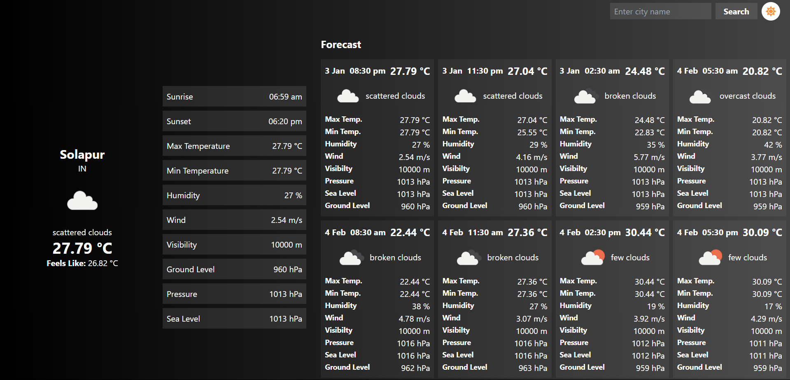

# Weather App



## Description
A weather app that allows the user to search for a city and see the current weather and a 5 day forecast.

## Installation
Clone the repository
```bash
git clone https://github.com/Ashish-Sunil-Vaidya/Weather-App.git

```

Inside the Weather-App folder, install the required dependencies
```bash
yarn
```

To host the app locally, run the following command
```bash 
yarn dev
```

